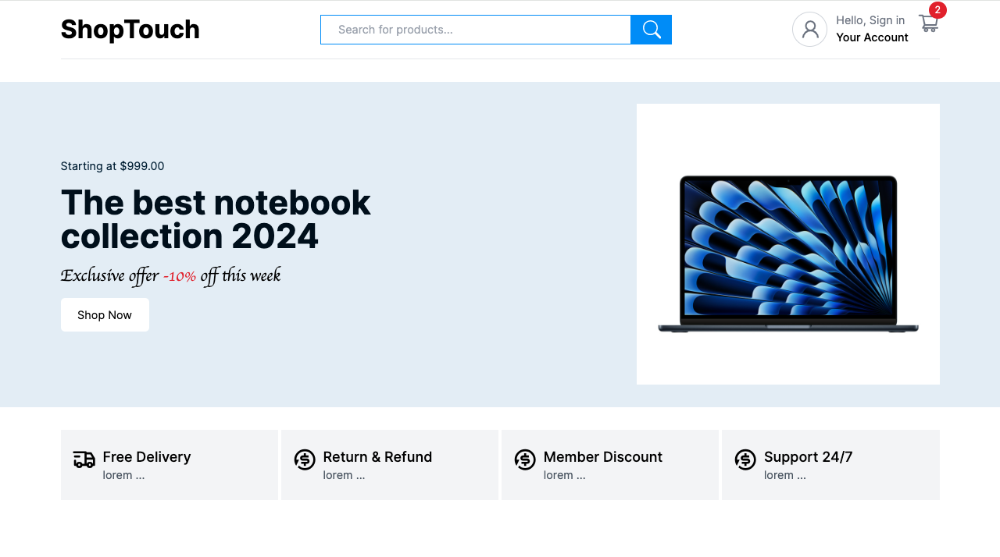

   
    
  <h1 align="center">ShopTouch E-Commerce Web application</h1>
  

    An E-commerce platform built with Next.js, Tailwind CSS and MongoDB. 
  

## 📋 Table of Contents

1. 🛍️ [Introduction](#introduction)
2. ⚙️ [Tech Stack](#tech-stack)
3. 🚀 [Features](#features)

## 🛍️ <a name="introduction">Introduction</a>

This is a full-stack e-commerce platform built using Next.js for the frontend, Tailwind CSS for styling, and MongoDB for the database. It provides a seamless shopping experience with features for browsing products, managing a shopping cart, and processing orders.

## ⚙️ <a name="tech-stack">Tech Stack</a>

- **Frontend:** Next.js, React.js, TypeScript, Tailwind CSS
- **Backend:** Node.js, Express.js
- **Database:** MongoDB
- **Image Upload:** UploadThing
- **Authentication:** NextAuth.js
- **State Management:** Redux Toolkit

## 🚀 <a name="features">Features</a>

- **Product Browsing:** Display products with images, descriptions, and prices.
- **Shopping Cart:** Add and remove items from the cart, and update quantities.
- **Admin Dashboard:** 
    - Add, edit, and delete products.
    - View and manage orders.
- **Secure Authentication:** User login and registration with NextAuth.js.
- **Image Uploads:** Handle product image uploads securely and efficiently with UploadThing.
